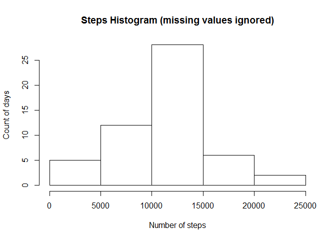
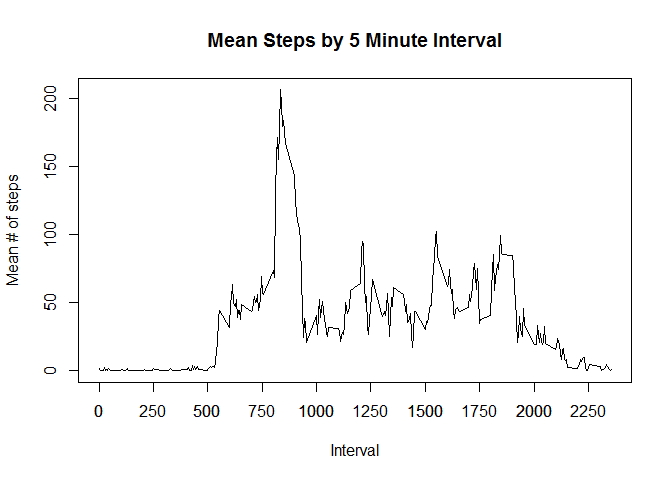
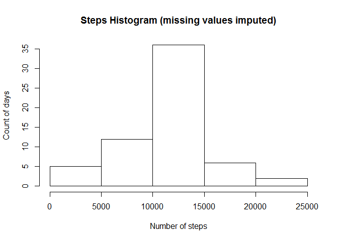
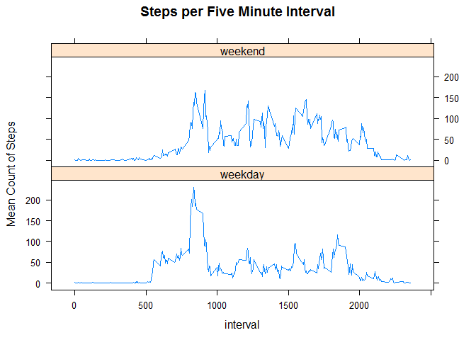

# Peer Assessment Week2
Paul Szydlowski  
May 2, 2017  
        
## Summary
In this exercise we want to explore the data from a personal activity monitoring device (e.g., Fitbit). This device collects data at 5 minute intervals through out the day. The data consists of two months of data from an anonymous individual collected during the months of October and November, 2012 and include the number of steps taken in 5 minute intervals each day. This data can be downloaded from https://d396qusza40orc.cloudfront.net/repdata%2Fdata%2Factivity.zip.

This assignment consists of the following:
        
* Load the data (i.e. read.csv())
* Process/transform the data (if necessary) into a format suitable for your analysis

### Perform an initial high level exploration of the data
Note: For this part of the assignment, you can ignore the missing values in the dataset.

* Calculate the total number of steps taken per day
* Make a histogram of the total number of steps taken each day
* Calculate and report the mean and median of the total number of steps taken per day

### Explore the average daily activity pattern

* Make a time series plot (i.e. type = "l") of the 5-minute interval (x-axis) and the average number of steps taken, averaged across all days (y-axis)
* Identify Which 5-minute interval, on average across all the days in the dataset, contains the maximum number of steps?

### Imputing missing values

* Calculate and report the total number of missing values in the dataset (i.e. the total number of rows with NAs)
* Devise a strategy for filling in all of the missing values in the dataset. The strategy does not need to be sophisticated. 
* Create a new dataset that is equal to the original dataset but with the missing data filled in.
* Make a histogram of the total number of steps taken each day and Calculate and report the mean and median total number of steps taken per day. 
* Determine whether these values differ from the estimates from the first part of the assignment? 
* What is the impact of imputing missing data on the estimates of the total daily number of steps?
* Are there differences in activity patterns between weekdays and weekends?

### Explore Differences bewtween Weekends and Weekdays

* Create a new factor variable in the dataset with two levels - "weekday" and "weekend" indicating whether a given date is a weekday or weekend day.
* Make a panel plot containing a time series plot (i.e. type = "l") of the 5-minute interval (x-axis) and the average number of steps taken, averaged across all weekday days or weekend days (y-axis). 


Load packages and download data

```r
library(stringr)
library(dplyr)
```

```
## 
## Attaching package: 'dplyr'
```

```
## The following objects are masked from 'package:stats':
## 
##     filter, lag
```

```
## The following objects are masked from 'package:base':
## 
##     intersect, setdiff, setequal, union
```

```r
library(lattice)
options(scipen = 999) # This is used to prevent the random use of scientific notation that was taking place in output below.
url <- "https://d396qusza40orc.cloudfront.net/repdata%2Fdata%2Factivity.zip"
filename <- "activity.csv"

if(!file.exists("activity.csv")){
        download.file(url,"data.zip")
        unzip("data.zip")
        file.remove("data.zip")
}
```
Read data into R

```r
activity <- read.csv(filename, stringsAsFactors = FALSE)
activity$date<-as.Date(activity$date)
```
Remove NA's to sum (aggregate) the total number of steps by day to be used for the initial histogram by day.

```r
act.by.day <- aggregate(activity$steps, by=list(activity$date), FUN=sum)
colnames(act.by.day) <- c("date", "steps")
```
Create a histogram of steps by day

```r
hist(act.by.day$steps, xlab="Number of steps", ylab="Count of days", main="Steps Histogram (missing values ignored)")
```

<!-- -->

```r
median.steps <- median(act.by.day$steps,  na.rm=TRUE)
mean.steps <- round(mean(act.by.day$steps, , na.rm=TRUE),0)
```
Median number of steps taken each day: 10765   
Mean number of steps each day: 10766

Aggregate all data by five minute time interval, such that each reported value is for that particular five minute interval across all the days reported, ignoring those with missing (NA) values.

```r
act.by.interval <- aggregate(activity$steps, by=list(activity$interval), FUN=mean, na.rm=TRUE)
colnames(act.by.interval) <- c("interval", "steps")
plot(act.by.interval$interval, act.by.interval$steps, type="l", xlab="Interval", ylab="Mean # of steps")
title(main="Mean Steps by 5 Minute Interval")
axis(side=1,at=seq(0,2355,250))
```

<!-- -->

```r
# order data and get the interval with the maximum number of steps over all days
ordered.int <- act.by.interval[order(-act.by.interval$steps,act.by.interval$interval),]
```
Subset the interval with the maximum mean number of steps

```r
max.int <- ordered.int[1,1]
max.steps <- round(ordered.int[1,2],0)
```
Interval with the highest average (mean) number of steps each day: 835 (206 steps)

Next, we want to examine the bias potentially introduced by missing observations. First, we get a count of missing values

```r
missing <- sum(is.na(activity))
```
There are 2304 missing values.

We have several options to impute missing values, including mean/median steps per day or mean/median step per interval. Of course, the day of the week may play a role in the number of steps taken, so mean/median number of steps for a given day of the week or specific time period for a given day of the week could also be used.

For this exercise, we will impute the missing values based upon the mean number of steps taken for each 5 minute interval, using the data stored in act.by.interval. 


```r
imputed.act <- activity
imputed.act$steps <- round(ifelse(is.na(imputed.act$steps) == TRUE, 
act.by.interval$steps[act.by.interval$interval %in% 
imputed.act$interval], imputed.act$steps),0)
imputed.act.by.day <- aggregate(imputed.act$steps, by=list(imputed.act$date), FUN=sum, na.rm=TRUE)
colnames(imputed.act.by.day) <- c("date", "steps")
hist(imputed.act.by.day$steps, xlab="Number of steps", ylab="Count of days", main="Steps Histogram (missing values imputed)")
```

<!-- -->

```r
imputed.median.steps <- median(imputed.act.by.day$steps)
imputed.mean.steps <- round(mean(imputed.act.by.day$steps),0)
```
Comparing the two histograms (raw data with missing values and data with imputed values) shows almost no difference, which might be expected when a simple mean is to impute missing values. Had we used day of the week or weekend/weekday averages depending upon the missing data, we might have seen a larger impact depending upon how skewed the missing data was likely to be.

Median number of steps each day with imputed values: 10762 ( -3 compared to median without imputed values)   
Mean number of steps each day with imputed values: 10766 (+ 0 compared to mean without imputed values)   


```r
imputed.act <- mutate(imputed.act, daytype=ifelse(weekdays(date) %in% c("Saturday", "Sunday"),"weekend", "weekday"))
imputed.act.by.interval <- aggregate(imputed.act$steps, by=list(imputed.act$daytype,  imputed.act$interval), FUN=mean, na.rm=TRUE)
colnames(imputed.act.by.interval) <- c("daytype", "interval", "steps")
imputed.act.by.interval$interval <- as.numeric(imputed.act.by.interval$interval)
#xyplot(steps ~ interval | daytype, date=imputed.act)
imputed.act.by.interval$daytype <- as.factor(imputed.act.by.interval$daytype)
xyplot(steps ~ interval | daytype, data=imputed.act.by.interval, type="l", layout=c(1,2),
main="Steps per Five Minute Interval", ylab="Mean Count of Steps")
```

<!-- -->

It appears that the number of steps appears to be greater on weekend days than weekdays. The number of steps declines noticeably after the early morning on weekdays, indicating possibly sedentary acitivities during the week, while the number of steps decline far less during the day on weekends.
